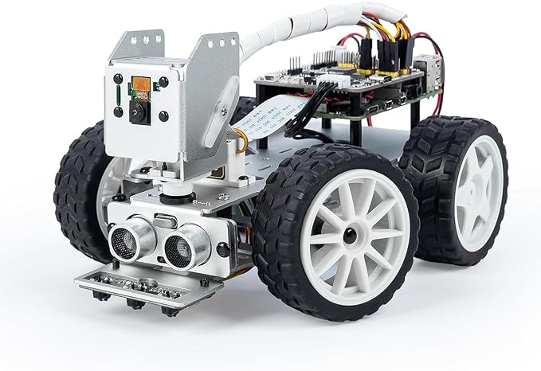

# Django Robot Controller Project

## Overview
The Django Robot Controller project is a web-based application designed to provide a user-friendly interface for controlling your robot. With support for controller input, this project allows you to effortlessly maneuver your robot and perform various actions remotely.



## Features
- **Controller Support**: Seamlessly control your robot using game controllers for a more intuitive experience.
- **Customizable Interface**: Easily adapt the control interface to suit the specifications of your robot.
- **Real-time Feedback**: Receive instant feedback on your robot's status and sensor data.
- **Responsive Design**: Access the controller interface from various devices, ensuring a responsive and adaptable experience.

## Requirements
- Python 3.x
- Django 3.x
- Pygame 2.5.X
- tkinter

## Setup
1. Clone the repository:
   ```bash
   git clone https://github.com/your-username/robot-controller-django.git
   cd robot-controller-django

2. Install Dependencies:
   ```bash
    pip install -r requirements.txt

3. start project:
   ```bash
   python manage.py runserver

4. Run Server on the robot:
   ```bash
   [needs to be added]


